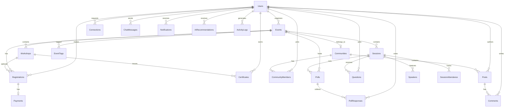

# EventNet Database Schema

## ER Diagram



## Tables (22)

All tables include `id`, `created_at`, `updated_at`. Soft-delete tables also have `is_deleted`, `deleted_at`.

| # | Table | Key Relationships |
|---|-------|-------------------|
| 1 | users | Central entity |
| 2 | events | FK → users, communities |
| 3 | sessions | FK → events |
| 4 | speakers | FK → sessions |
| 5 | workshops | FK → events |
| 6 | registrations | FK → users, events, workshops |
| 7 | payments | FK → users, registrations |
| 8 | connections | FK → users (requester, receiver) |
| 9 | chat_messages | FK → users, events, sessions |
| 10 | polls | FK → events, sessions, users |
| 11 | poll_responses | FK → polls, users |
| 12 | questions | FK → sessions, users |
| 13 | notifications | FK → users |
| 14 | communities | FK → users (owner) |
| 15 | community_members | FK → communities, users |
| 16 | posts | FK → communities, users |
| 17 | comments | FK → posts, users |
| 18 | session_attendance | FK → sessions, users |
| 19 | certificates | FK → users, workshops, events |
| 20 | event_tags | FK → events |
| 21 | ai_recommendations | FK → users |
| 22 | activity_logs | FK → users, events |

## Migrations

```bash
cd backend
export FLASK_APP=run.py
flask db migrate -m "description"
flask db upgrade
```

## Seed Data

```bash
python seed.py
```

Creates admin, organizer, attendee users and a sample AI Summit 2026 event.
